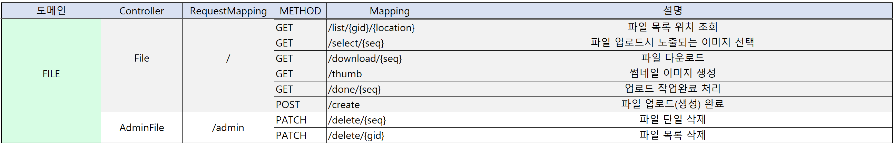
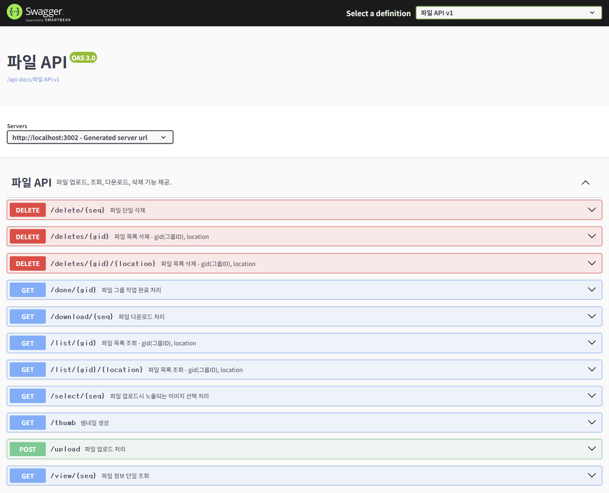

  

# AnonymousCIS 프로젝트

# 기능 명세서

## 🔹 도메인 URL 설계 🔹

## 🔹 관리자 페이지 🔹
- 썸네일 기본이미지크기 설정
  - 너비와 높이를 정확하게 맞추는게 아닌 둘중에 큰걸 기준으로 이미지가 짤리는걸 방지하기 위해서 맞추는 작업

- 확장자 제한
- 파일삭제
- 한글깨짐현상 방지
- 파일 업로드 실패시 DB 저장 데이터 삭제

## 🔹 사용자(회원) 페이지 🔹
- 파일조회
- 파일업로드
- 파일다운로드
- 썸네일
- 파일삭제(파일소유자만 삭제가능하게 통제)

## 🔹 Swagger API 🔹
- 링크 : https://cis-file-service.onedu.blue/apidocs.html

  

# ERD 작성 (엔티티 관계도)

# FILE_INFO
| 키  | 논리 | 물리           | 도메인 | 타입          | Length | UNIQUE | NULL허용 | 기본값 |
|:--:|-----------------------|--------------|---------------|-------------|--------|--|------|---|
| pk | 파일 등록 번호                  | SEQ          | Long          | NUMBER      |        |        |
|    | 파일 그룹                     | GID          | String        | VARCHAR     | 45     |        | N      |   |       |
|    | 그룹 내에서 위치                 | LOCATION     | String        | VARCHAR     | 45     |        |        |   |  |
|    | 업로드시 원 파일명                | FILE_NAME    | String        | VARCHAR     | 100    |        | N      |   |       |
|    | 파일 확장자                    | EXTENSION    | String        | VARCHAR     | 30     |         |        |   |       |
|    | 파일 형식                     | CONTENT_TYPE | String        | VARCHAR     | 30     |        |        |
|    | URL로 파일 접근할 수 있는 주소       | FILE_URL     | String        | VARCHAR     |        |        |        |   |       |
|    | 파일이 서버에 잇는 경로             | FILE_PATH    | String        | VARCHAR     |        |        |        |   |       |
|    | 썸네일 기본 URL                | THUMB_URL    | String        | VARCHAR     |        |        |        |   |       |
|    | 작업 완료 여부                  | DONE         | Boolean       | NUMBER(1,0) |        |        |        |   |       |
|    | (노출을 하나만 하는 경우) 대표 이미지 선택 | SELECTED     | Boolean       |  NUMBER(1,0)     |        |        |        |   |       |
|    | 정렬 순서 (오름차순)              | LIST_ORDER   | Long          | NUMBER      |        |        |        |   |       |
|    | 등록일시                      | CREATEDAT    | LocalDateTime | DATE        |        |         |        | SYSDATE 
|    | 수정일시                      | MODIFIEDAT   | LocalDateTime | DATE        |        |         |        | SYSDATE 
|    | 삭제일시                      | DELETEDAT    | LocalDateTime | DATE        |        |         |        | SYSDATE 

